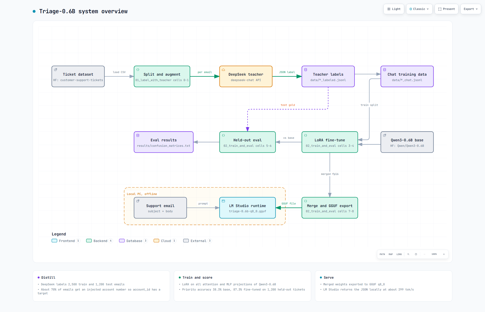
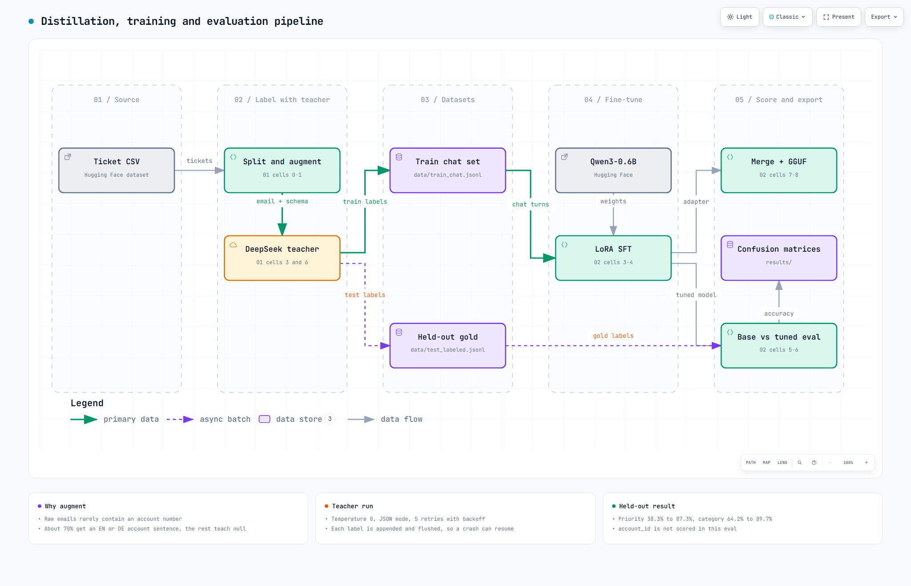
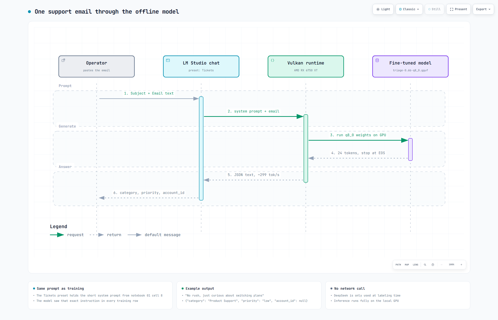
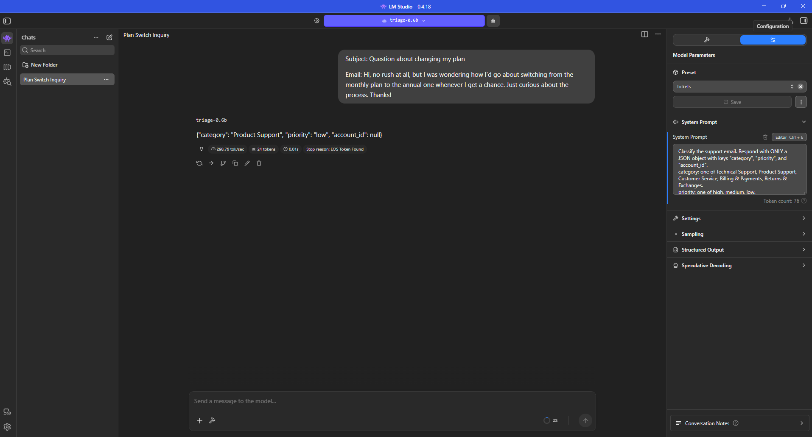

# Support-Ticket Triage via Small-Model Distillation

A 600M-parameter model that reads a support email and returns structured triage as JSON: `category`, `priority`, `account_id`. It runs locally on a consumer GPU. No API call at inference time.

The model is a distilled copy of a frontier teacher. Distillation here means something simple. Take a strong model (DeepSeek), use it to label a pile of tickets, then fine-tune a small student (Qwen3-0.6B) to reproduce those labels. The student does the teacher's job at a fraction of the size and cost.

Here is the task in one example. An email comes in:

> "Hi, no rush at all, but I was wondering how I'd go about switching from the monthly plan to the annual one whenever I get a chance. Just curious about the process."

Same email, two models.

**Base Qwen3-0.6B** ignores the task and answers the customer instead:

> "Switching from a monthly to an annual plan is a common requirement, but the exact process depends on your service provider's specific policies. Here's a general guide: 1. Confirm Your Current Plan... 2. Create an Annual Account... 3. Update Subscription Details..."

No JSON. No `category`, `priority`, or `account_id`. The base model doesn't misclassify the ticket, it doesn't register that classification is the task at all.

**Fine-tuned:**

```json
{"category": "Product Support", "priority": "low", "account_id": null}
```

Ground truth is `priority: low`: a polite, non-blocking question is not urgent. The gap, from "writes the customer an essay" to "returns clean structured triage," is what training bought. This is the 49-point priority jump from the headline table, made concrete.

Keywords for the skim: knowledge distillation, LoRA fine-tuning, PEFT, supervised fine-tuning, Qwen3-0.6B, Hugging Face Transformers, PyTorch, structured JSON output, text classification, GGUF quantization, held-out evaluation.

---

## Headline result

Tested on 1,200 held-out tickets the model never saw during training.

| Metric | Base Qwen3-0.6B | Fine-tuned | Trivial baseline |
|---|---|---|---|
| Priority accuracy | 38.3% | **87.3%** | 42.4% (always "high") |
| Category accuracy | 64.2% | **89.7%** | 63.8% (always "Technical Support") |
| Valid JSON | 100% | 100% | n/a |

Read the priority row slowly. The base model scores 38.3%. A dumb classifier that ignores the email and always guesses "high" scores 42.4%. So the base 0.6B is worse than guessing. Fine-tuning takes it to 87.3%. That 49-point jump is the point of the whole project. The capability is not sitting in the base model waiting to be prompted out. Training puts it there.

---

## How it works

DeepSeek labels support emails, a small Qwen3-0.6B model is fine-tuned with LoRA to copy those labels, and the result runs offline in LM Studio.


The full system: teacher labeling, LoRA fine-tune, held-out eval, GGUF export and the offline runtime.


How the data moves through notebooks 01 and 02, from the ticket CSV to the confusion matrices and the GGUF file.


One email going through LM Studio on a local GPU and coming back as `category`, `priority` and `account_id` JSON.

Interactive versions with pan, zoom and theme switch: `docs/diagrams/overview.html`, `docs/diagrams/pipeline.html`, `docs/diagrams/main-flow.html`


## Running locally



The fine-tuned model in LM Studio on an AMD RX 6750 XT, Vulkan runtime. No API. This is the GGUF build, not the training checkpoint.

The ticket here is a soft one. "No rush at all, just curious about switching plans." The model reads it as `Product Support`, `priority: low`, `account_id: null`, and returns clean JSON at about 299 tokens per second. Low urgency on a polite non-blocking question is exactly the call the base model could not make. It defaulted everything to medium.

---

## The problem

Routing a support ticket means reading an email and making three calls. Which queue does it go to. How urgent is it. Whose account is this. A frontier model handles that well, but it costs an API call per ticket and ships your customer data off-box.

So the question is plain. Can a 600M model do the same job locally, well enough to actually deploy. This project is the answer, and the method is distillation. Label a corpus with a strong teacher, then train a small student to copy the labels. The student runs offline with no per-call cost.

---

## What the base model actually does

The interesting part is how the base model fails. It is not the failure you would guess.

It does not pile everything into "high." It piles everything into "medium." Around 63% of all tickets land there, no matter how urgent they really are.

```
priority, BASE (rows = true label, cols = prediction)
          high   medium   low
high       251      244    13
medium      89      201     9
low         67      317     8
```

(One base response was invalid JSON and is dropped from this view; the full matrix with that `none` column is in the [results file](results/confusion_matrices.txt).)

Rows are the truth. Columns are the guess. Look down the middle column. Every true class gets shoved into "medium." The model has no real read on urgency, so it picks the safe middle and hopes.

Now the fine-tuned model on the same 1,200 tickets.

```
priority, FINE-TUNED (rows = true label, cols = prediction)
          high   medium   low
high       434       74     1
medium      33      231    35
low          0        9   383
```

That is a clean diagonal. Predictions line up with truth. `high` recall is 85%. `low` recall is 98%. `medium` is the weak spot at 77%, which tracks. "Medium" is the fuzzy class. It is everything not clearly on fire and not clearly trivial.

Here is the part an ML reader should care about. This was not a skew you could patch with a threshold or a class weight. The base model had no usable priority signal at all. The fine-tune built that signal from nothing.

Full verbatim eval output, including the JSON-validity counts, is in [results/confusion_matrices.txt](results/confusion_matrices.txt).

---

## How it works

```
20k multilingual tickets (CC BY-NC 4.0)
        |
        |- Teacher labeling: DeepSeek (deepseek-chat) -> {category, priority, account_id}
        |     temperature 0, JSON mode, fixed schema
        |
        |- Augmentation: inject account-number sentences (EN/DE) into ~70% of emails
        |     so the model has an extraction target to learn
        |
        |- Split: 2,500 train / 1,200 held-out test (stratified, seed 42)
        |
        |- Student: Qwen3-0.6B + LoRA (r=16, all attention and MLP projections)
        |     2 epochs, ~312 steps, lr 2e-4
        |
        |- Export: merged 16-bit checkpoint -> GGUF q8_0 (near-lossless for 0.6B)
        |
        |- Serve: LM Studio, Vulkan runtime, AMD RX 6750 XT, ~299 tok/s, no API
```

One detail worth calling out. The teacher's labels are the gold standard the student trains and gets scored against. The test set comes from the same source and the same label pipeline, but it is fully held out of training. So the 87.3% measures generalization, not memorization.

---

## Reproduce

0. Set your teacher API key. The labeling notebook reads `os.environ["DEEPSEEK_API_KEY"]`. Export it locally (`export DEEPSEEK_API_KEY=...`) or add it through Kaggle Add-ons, Secrets. No key is stored in the repo.
1. Label. Run [notebooks/01_label_with_teacher.ipynb](notebooks/01_label_with_teacher.ipynb) to generate `data/train_labeled.jsonl` and `data/test_labeled.jsonl` from the source dataset.
2. Build chat data. Join labels with the augmented emails into `data/train_chat.jsonl` and `data/test_chat.jsonl` (system, user, assistant turns).
3. Train. LoRA fine-tune Qwen3-0.6B on `train_chat.jsonl` in [notebooks/02_train_and_eval.ipynb](notebooks/02_train_and_eval.ipynb). Single GPU, about 15 minutes on a T4.
4. Evaluate. Run base versus fine-tuned over the 1,200-row held-out set. The eval cell prints both confusion matrices and the accuracy lift.
5. Serve. Export to GGUF q8_0 and load in LM Studio with the Vulkan runtime.

---

## Repo layout

```
.
|- README.md
|- requirements.txt
|- notebooks/
|   |- 01_label_with_teacher.ipynb   # teacher labeling (DeepSeek)
|   |- 02_train_and_eval.ipynb       # LoRA fine-tune + base-vs-tuned eval
|- data/
|   |- train_labeled.jsonl           # teacher labels
|   |- test_labeled.jsonl
|   |- train_chat.jsonl              # chat-formatted training data
|   |- test_chat.jsonl
|- results/
    |- confusion_matrices.txt        # verbatim eval output
```

---

## What this does not prove

Reading these honestly matters more than the headline number.

- The gold labels are the teacher's labels, not human truth. 87.3% means the student agrees with DeepSeek 87% of the time. For a distillation project that is the correct thing to measure. It is not the same as human-verified accuracy, and I am not going to pretend it is.
- `medium` is the weak class at 77% recall. The fuzzy middle is genuinely hard and the model inherits that.
- The tickets are synthetic, not real production traffic. Performance on real tickets is untested, and the distribution will shift.
- One training run, one seed. No variance bars.

---

## Stack

Python, PyTorch, Qwen3-0.6B, LoRA and PEFT, Hugging Face Transformers, DeepSeek (teacher), llama.cpp and GGUF, LM Studio (Vulkan).

---

## Data and license

Source: [Tobi-Bueck/customer-support-tickets](https://huggingface.co/datasets/Tobi-Bueck/customer-support-tickets). Bueck, T. (2025), Multilingual Customer Support Tickets (Synthetic), CC BY-NC 4.0. Used for non-commercial research and portfolio purposes.