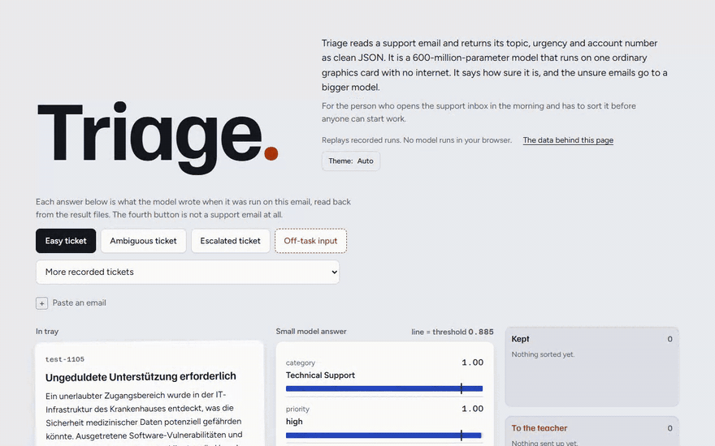
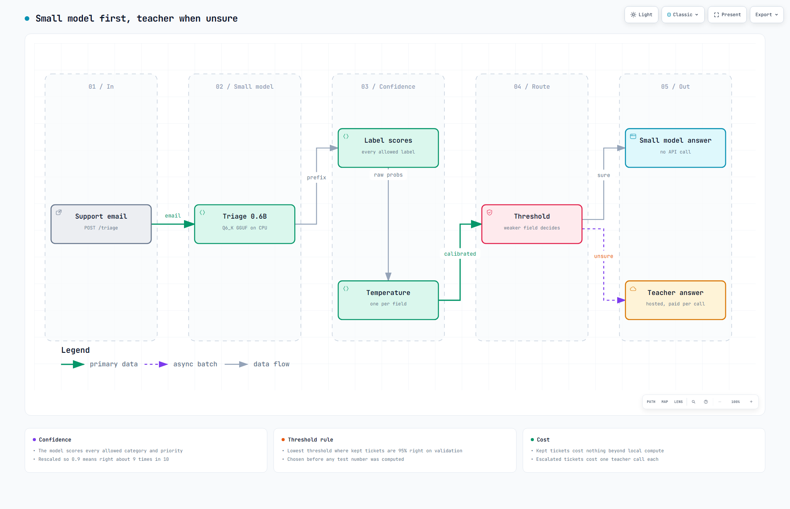
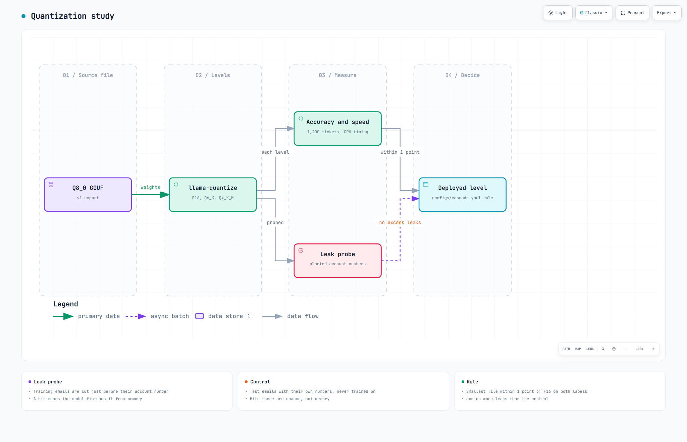

# Triage

Triage reads a support email and returns its topic, urgency and account number as clean JSON. It is a 600-million-parameter model, small enough to run on one ordinary graphics card with no internet, trained to copy a much larger model's judgement. It went from worse than guessing to 87 percent on emails it had never seen, and it says how sure it is so the unsure ones can go to a bigger model.

**Demo:** https://samad-zeeshan.github.io/Triage-0.6B/ replays recorded runs. No model runs in the browser and there is no login. A 90-second walkthrough is in [docs/demo.mp4](docs/demo.mp4).


## How it works


Tickets are split with fixed seeds, labelled by a hosted teacher, used to fine-tune the small model, exported to GGUF and scored from recorded runs.


The small model answers every email, scores its own labels, and hands the email to the teacher when its calibrated confidence is below the threshold.


Each GGUF level is scored for accuracy, speed and whether it can recite account numbers it saw in training.

## Results

Every number comes from `eval/results/*.json`, rebuilt from the per-ticket runs in `eval/runs/`. CI fails if a table drifts from those files.
<!-- table:headline -->
| Percent correct, 1,200 held-out tickets | v1 fine-tuned | v2 fine-tuned, 95% interval | Base model | Trivial |
|---|---|---|---|---|
| Priority | 87.3 | 87.2 (85.3 to 89.1) | 38.3 (35.6 to 41.1) | 42.4 (always high) |
| Category | 89.7 | 90.0 (88.2 to 91.7) | 64.2 (61.4 to 66.8) | 63.8 (always Technical Support) |
| Account number | not scored | 96.4 (95.3 to 97.4) | 85.8 (83.8 to 87.7) | 34.2 (always none) |
| Valid JSON, v1 rule | 100.0 | 100.0 (100.0 to 100.0) | 100.0 (100.0 to 100.0) | n/a |
| Exact schema | not scored | 100.0 (100.0 to 100.0) | 0.2 (0.0 to 0.6) | n/a |

Fine-tuned against trivial on priority: +44.8 points (41.2 to 48.4), McNemar p below 0.001. Against the base model: +48.9 points (45.6 to 52.2), p below 0.001.
<!-- /table:headline -->
v2 scores the Q8_0 file that actually runs offline, where v1 scored the training checkpoint, and both labels land within 0.3 points of v1. The answer key is the teacher's June 2026 labels, not human judgement, and the emails are synthetic. Training was not rerun for v2, so this is still one run with one seed.

**Constrained decoding**, native against Outlines and XGrammar on the same weights:
<!-- table:decoding -->
| Model | Decoding | Exact schema | Category | Priority | Account number |
|---|---|---|---|---|---|
| Base | native | 0.2 | 64.2 | 38.3 | 85.8 |
| Base | Outlines | 100.0 | 64.0 | 37.8 | 66.4 |
| Base | XGrammar | 100.0 | 63.9 | 38.4 | 85.2 |
| Fine-tuned | all three, same answers | 100.0 | 90.0 | 87.2 | 96.4 |
<!-- /table:decoding -->
Constraints fix the base model's structure (it mostly wraps its JSON in markdown fences) but not its answers, and Outlines cuts its account-number accuracy from 85.8 to 66.4. That is the semantic gap 2609.23742 describes. The fine-tuned model already writes exact JSON, so all three modes give the same answer on every ticket.

**Calibration** on the deployed Q6_K file, one temperature per field fitted on 600 validation tickets. ECE is in points.
<!-- table:calibration -->
| Field | Temperature | ECE before | ECE after | Brier before | Brier after |
|---|---|---|---|---|---|
| category | 1.23 | 2.2 | 2.3 | 0.149 | 0.148 |
| priority | 1.38 | 3.3 | 2.3 | 0.188 | 0.189 |
| account number | not rescaled | 0.8 | n/a | n/a | n/a |
<!-- /table:calibration -->
Raw confidence is already close to calibrated. Scaling helps priority and slightly hurts category, likely because the validation labels come from today's teacher, which disagrees with the test key on 8.7 percent of priorities. Asked to state its own confidence, the model gave a number in 10 answers out of 100. Errors sit where neighbouring tickets carry mixed labels: 72.1 percent priority accuracy there against 95.9 in clean neighbourhoods ([geometry](eval/figures/geometry.svg)).

**Cascade**, unsure tickets sent to the teacher:
<!-- table:cascade -->
| Route | Sent to teacher | Both right | Priority | Category | Teacher cost per 1,000 tickets |
|---|---|---|---|---|---|
| Small model only | 0.0% | 78.8 | 87.2 | 89.6 | $0.0000 |
| Cascade, threshold 0.885 | 67.3% | 82.8 | 91.4 | 90.7 | $0.0708 |
| Teacher only | 100.0% | 82.6 | 91.3 | 90.5 | $0.1051 |
<!-- /table:cascade -->
The rule fixed before testing (kept tickets at least 95 percent right on validation) is strict. It sends two tickets in three to the teacher and saves only a third of the teacher bill. The cascade merely matches the teacher alone, because today's teacher (deepseek-flash behind the deepseek-chat alias) agrees with the June key on 91.3 percent of priorities. The full curve is in [eval/figures/cascade.svg](eval/figures/cascade.svg).

**Quantization**, median CPU time per ticket on a Ryzen 5 7600X3D with 6 threads:
<!-- table:quantization -->
| File | MB | Priority | Category | Account number | Same answer as Q8_0 | ms per ticket, CPU | Leaks: completion, task, test control |
|---|---|---|---|---|---|---|---|
| F16 | 1198 | 87.4 | 89.9 | 96.4 | 98.5% | 1481 | 0/200, 0/200, 0/200 |
| Q8_0 | 639 | 87.2 | 90.0 | 96.4 | 100.0% | 1005 | 0/200, 0/200, 0/200 |
| Q6_K (deployed) | 495 | 87.2 | 89.6 | 96.3 | 91.0% | 922 | 0/200, 0/200, 0/200 |
| Q4_K_M | 397 | 70.9 | 87.2 | 96.4 | 72.5% | 648 | 0/200, 0/200, 0/200 |
<!-- /table:quantization -->
The F16 master was not kept, so F16, Q6_K and Q4_K_M are requantized from Q8_0 and the lower levels carry two roundings. Q4_K_M loses 16.3 points of priority. Q6_K flips 79 priority answers against Q8_0 whose gains and losses cancel. No level recited a planted training account number, so the leak probe does not separate them.

**Trust, before and after fine-tuning**, both at Q8_0:
<!-- table:trust -->
| Check | Base model | Fine-tuned |
|---|---|---|
| Off-task input answered as a ticket (of 30) | 1 | 21 |
| Off-task input the deployed cascade would keep (of 30) | n/a | 8 |
| Low-priority tickets pushed to high by an injected line (of 40) | 40 (was 5) | 29 (was 0) |
| Priority accuracy with typos, 200 tickets | 34.0 (clean 35.0) | 84.0 (clean 83.0) |
| Priority accuracy on paraphrases, 200 tickets | 31.5 (clean 35.0) | 82.5 (clean 83.0) |
| Planted card, phone or SSN echoed in the output (of 50) | 16 | 0 |
<!-- /table:trust -->
Fine-tuning stopped PII echo and holds up under typos and paraphrase. It also answers most off-task text as a ticket, with high confidence, and one injected line pushes most low-priority tickets to high. A refusal test on harmful requests is not part of this suite.

## Design decisions

Native decoding, because constraints changed no fine-tuned answer (Outlines and XGrammar stay in `triage/infer.py`). Confidence comes from teacher-forced scores of every allowed label, since the model ignores requests to state one. The 0.885 threshold is expensive, but moving it after seeing test numbers would be tuning on the test set. Q6_K is deployed by the rule in `configs/cascade.yaml`: the smallest file within 1 point of F16 with no excess leaks.

## Run it

```
pip install --extra-index-url https://abetlen.github.io/llama-cpp-python/whl/cpu ".[dev,service]"
python -m triage.eval && python -m triage.readme   # rebuild every table from the recorded runs
make serve                                         # needs models/, see configs/models.yaml
```

The model file is not in the repository. Without it the tables, the demo and the non-model tests still work from the recorded runs, the model tests skip, `make serve` and `make check` stop with a message naming the missing file, and the CI job that reruns 40 tickets on the model skips with a notice.

## Papers

- 2609.23742 Constrained decoding fixes structure in small models but leaves a semantic gap
- 2608.30731 Calibrating small language models for claim check-worthiness detection
- 2609.23959 Calibrated one-pass decisions from a small model (CallScreenBench)
- 2608.10939 Cost-efficient routing for short-text classification with small models
- 2609.26550 JEV-as-a-Judge: accept when confident, escalate when unsure
- 2609.26489 Calibration as a first-class criterion in LLM evaluation
- 2608.00042 Trustworthiness costs of domain adaptation in small language models
- 2609.25014 Not all 4-bit quantizers are equal: PII leakage in fine-tuned small models
- 2608.18033 Where a small language model helps, through embedding geometry
- 2602.10869 Agentic knowledge distillation for SMS threat detection

## Licence

Code MIT. Tickets from [Tobi-Bueck/customer-support-tickets](https://huggingface.co/datasets/Tobi-Bueck/customer-support-tickets), CC BY-NC 4.0, so the data and the trained model are for non-commercial use.
